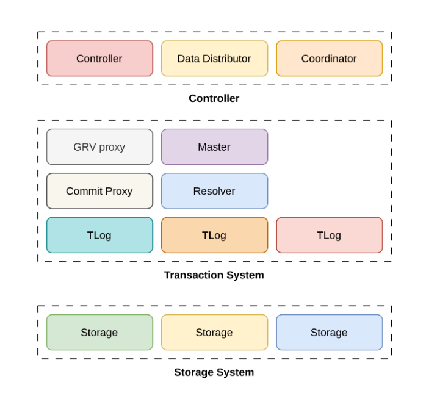
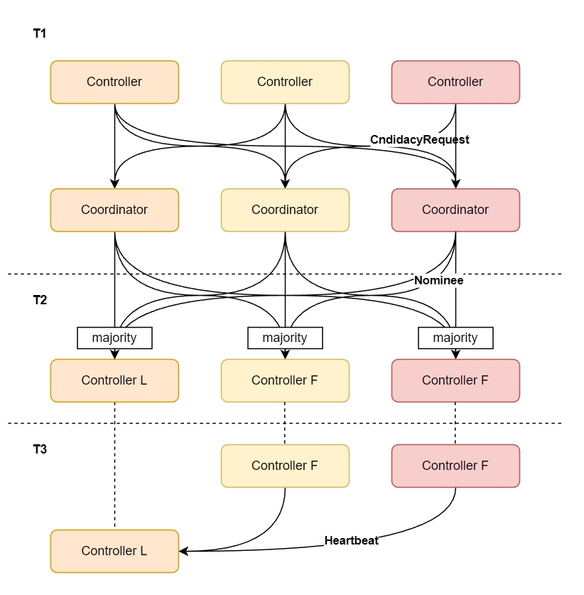

前两篇文章已经完整地介绍了 FoundationDB 的扩展能力，这一篇文章将介绍 FoundationDB 架构的最后一部分：FoundationDB 的容错。

从实现机制上讲，FoundationDB 的容错可以按照数据组织方式划分为三部分：控制系统容错、事务系统容错、存储系统容错。



## 控制系统

控制系统中参与容错的重要角色是 coordinator，它背后的分布式一致性算法 paxos 为它提供了容错能力。大多数分布式系统工作在异步、非拜占庭消息模型下，依靠多副本提供容错能力；paxos 算法解决了该模型下多副本间数据的一致性问题。在 paxos 算法的加持下，FoundationDB 在只要集群中仍有多于半数的 coordinator 节点存活时（无故障、无网络隔离），就能对外提供服务。由于 paxos 不是本文重点，所以不做更多介绍，更多关于 paxos 算法的细节可以阅读论文《paxos made simple》。

> The Paxos algorithm, when presented in plain English, is very simple.  Leslie Lamport

FoundationDB 中的 coordinator 角色是用户手动设置的，下面是一个例子：

```
user@host$ fdbcli
Using cluster file `/etc/foundationdb/fdb.cluster'.

The database is available.

Welcome to the fdbcli. For help, type `help'.
fdb> coordinators 10.0.4.1:4500 10.0.4.2:4500 10.0.4.3:4500
Coordinators changed
```

用户设置的 coordinators 会与 cluster key 一起组成 cluster 的唯一标识，并保存到 `fdb.cluster` 文件中；sdk 可以通过该文件找到 coordinator 并操作 FoundationDB 集群。

### 选主

Coordinator 的第一个职责是协调并选举出一个合适的 controller 成为 leader，只有成为 leader 的 controller 才能开始工作；controller 负责管理整个 FoundationDB 集群，并使之能够对外提供服务。新加入集群中的节点如果一段时间未接收到来自 leader 的心跳，则会触发新一轮选举，直到选出新的 leader 为止。



选举开始时，controller 会发送 `CandidacyRequest` 给所有 coordinator。Coordinator 会按照一定规则选择出优先级最高的 controller 作为被提名人（Nominee）广播给 controller。当某个 controller 在一轮选举中收到超过半数节点的提名就会成为 leader。新 leader 上任后，会定期广播心跳给其余节点，以抑制后者发起新选举的流程。

### Coordinated State

Coordinator 的第二个职责是负责提供元数据的容错。


每个 coordinator 会提供 `GenerationReg` 的读写服务，它扮演了 paxos 算法中的 acceptor 角色：对于读写请求，会各自携带一个读写 generation，而 `GenerationReg` 保证了只响应不小于已经恢复的 generation 的请求。Leader controller 则通过组件 `CoordinatedState` 读写 `GenerationReg`。`CoordinatedState` 组件扮演了 paxos 算法中的 proposal 角色，它通过 `ReplicatedWrite` 和 `ReplicatedRead` 来保证对 `GenerationRegs` 读写的线性一致性。

`GenerationReg` 和 `CoordinatedState` 一起组成了一个线性一致的 key-value store。实际上，这个 key-value store 中只存储了一条记录：`ClusterKey` => `DbCoreState`。其中 `ClusterKey` 是记录在 `fdb.cluster` 中的 `description` 和 `id`，`DBCoreState` 中则记录了事务系统的元数据，其中最核心的是 TLog 的拓扑以及数据分布。

### 服务发现

`fdb.cluster` 在 FoundationDB 中负责提供集群的服务发现。因为 coordinator 是用户手动配置的，因此如果任何一个 coordinator 宕机，都需要人工设置新的 coordinators 进行替换。当 coordinators 发生变更时，`fdb.cluster` 中记录的内容也需要同步变更。FoundationDB 的 client 会监控集群 leader 的变化，一旦发现 leader 中记录的 coordinators 与本地文件中记录的不同，则会用新的记录更新本地 `fdb.cluster` 文件。对于 sdk，只有 `fdb.cluster` 有读写权限时才会主动更新。

## 事务系统

选出来的 leader 会成为集群的 controller，它负责管理整个集群，其中就包括事务系统的容错。controller 会监控事务系统的各个节点，如果事务系统不存在或者任意一个节点被监控系统判断为失联、故障，则 controller 会触发一次事务系统的 recovery。

recovery 流程会选择合适的 fdbserver 并拉起 master, GRV proxies, commit proxies, resolvers 和新的 TLogs。recovery 的核心问题是在新旧事务系统切换时保证读写请求的一致性。

因此 recovery 的第一件事情便是冻结原 TLogs 的写入。（TODO：需要冻结多少个才算完成呢？多数派？还是一个就行？如果有任何一个节点没有被封印，那么它一直接收日志，会影响 recovery 过程中的恢复吗）

一旦 TLogs 被成功封印，原来事务系统中正在进行的事务将不会得到提交。这一点与其他的系统也是类是的，比如 facebook 的 bookkeeper，StreamNative 的 pulsar。唯一不同的是原 TLog 中剩余的那部分日志将不会被复制到新 TLog 中，这是因为 storage 会迅速的消费这部分 TLog 并持久化，最后这些 TLog 就会被回收。

读请求能读到的事务数据受 master 控制，master 需要在启动时推进事务时间戳，以保证读请求的有效性（TODO：需要进一步验证）。只要 5s 时间锅后，那么新请求也将超过 resolver 的 MVCC 窗口，因此新提交的事务也不会与原来的事务产生冲突。

另一个需要解决的问题是，client 如何观察到事务系统的变更？Proxy 在 DbInfo 中记录了 Txn 的状态，当有变更时会通过xxx广播给 client（集群中使用 client 的其他节点同理）。原来的 master 等节点是如何退场的？（一些事务无法确定其执行状态，比如一个事务已经复制给某几个 TLog，最终被 storage 拉到本地持久化，这就需要使用这自己进行重试。后面一片文章介绍）

## 存储系统

和前两个系统相比，存储系统的容错过程则简单得多。controller 会启动一个 Data Distributor 服务，后者监控集群中的副本状态，如果有一个副本失联，那么它会选择一个合适的机器，并发送 MovingShard 请求给该机器，这个新机器将会从剩余的健康机器中拉取存量数据；这个过程中它也会从 TLog 中拉取增量数据，但是增量数据会缓存在内存中，直到所有存量数据都拉取完并完成持久化。


