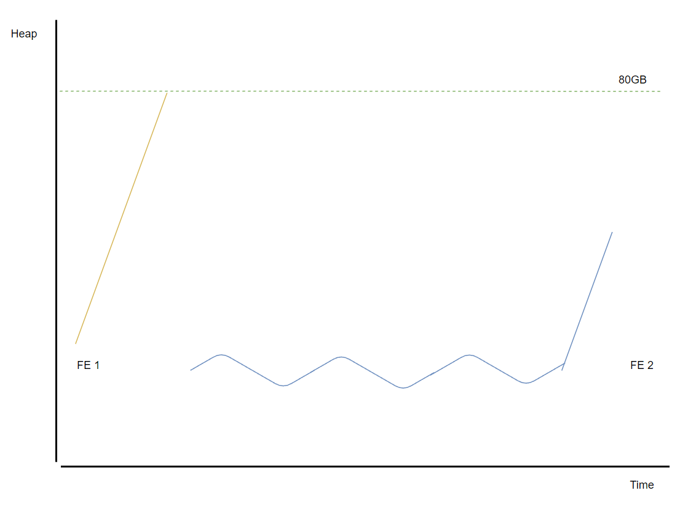
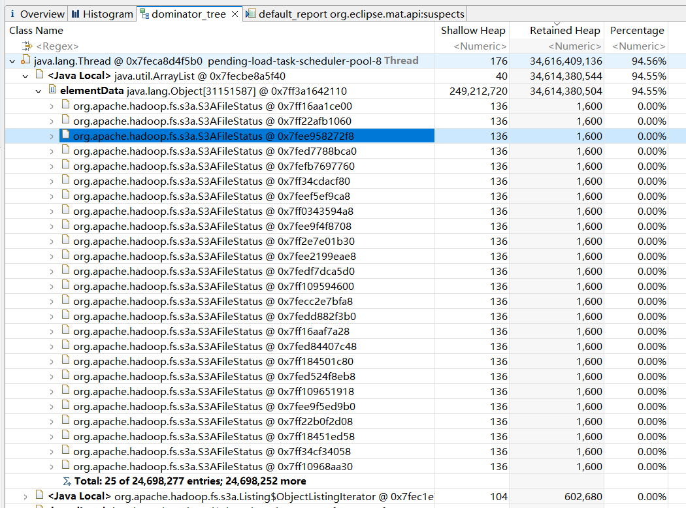
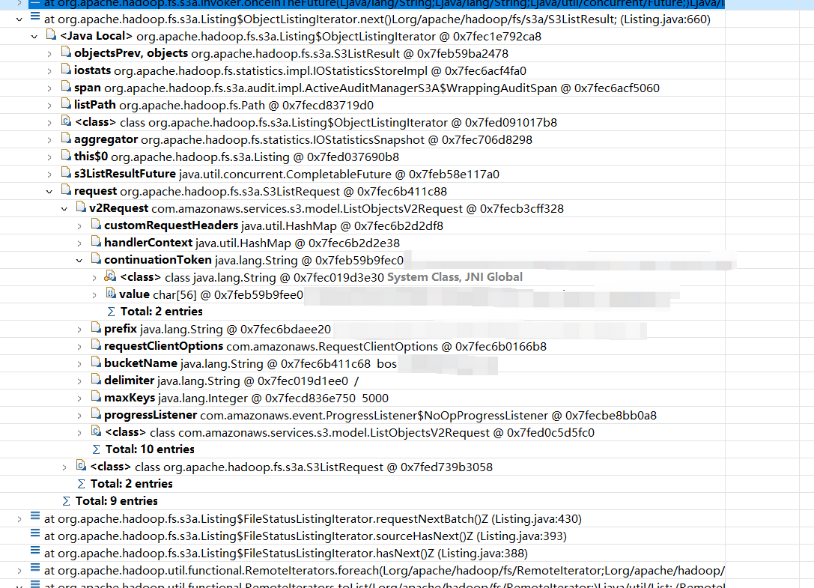
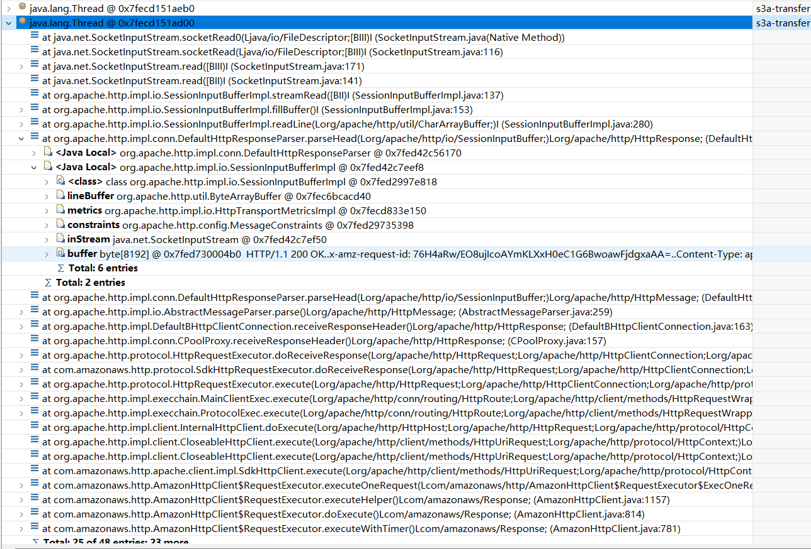

给 doris 打杂的这段时间里我修过不少 OOM 问题，它们大都属于代码质量缺陷，排查与修复过程也平平无奇，没有记录的意义。但这次的 case 不同，问题的原因出人意料，且排查过程还有运气与灵感的成分，因此值得将它的排查过程记录下来。

下面让我详细介绍我的整个排查流程。

## 背景

故事的起因是客户反馈他们的 FE master 进程在凌晨莫名退出，且管控没有自动将 FE 拉起，因此连续两个 FE 进程退出后，doris 集群无法读写。

通过排查用户提供的日志，我发现 FE master 退出的原因是集群中找不到满足 majority 策略的活跃副本，因此抛出了 `InsufficientReplicasException`：

```
2024-02-03 14:54:40,539 ERROR (txnCleaner|92) [BDBJEJournal.write():183] catch an exception when writing to database. sleep and retry. journal id 21339499
com.sleepycat.je.rep.InsufficientReplicasException: (JE 18.3.12) Commit policy: SIMPLE_MAJORITY required 1 replica. But none were active with this master.
	at com.sleepycat.je.rep.impl.RepImpl.preLogCommitHook(RepImpl.java:1309) ~[je-18.3.14-doris-SNAPSHOT.jar:18.3.14-doris-SNAPSHOT]
	at com.sleepycat.je.rep.txn.MasterTxn.preLogCommitHook(MasterTxn.java:217) ~[je-18.3.14-doris-SNAPSHOT.jar:18.3.14-doris-SNAPSHOT]
	at com.sleepycat.je.txn.Txn.commit(Txn.java:737) ~[je-18.3.14-doris-SNAPSHOT.jar:18.3.14-doris-SNAPSHOT]
	at com.sleepycat.je.txn.Txn.commit(Txn.java:631) ~[je-18.3.14-doris-SNAPSHOT.jar:18.3.14-doris-SNAPSHOT]
	at com.sleepycat.je.txn.Txn.operationEnd(Txn.java:1773) ~[je-18.3.14-doris-SNAPSHOT.jar:18.3.14-doris-SNAPSHOT]
	...
```

抛出这个异常的背景是： FE 底层使用了 Berkeley DB Java Edition （BDBJE）做日志同步，后者内部使用了 paxos 算法来保证日志在副本间的一致性。Doris FE 默认使用的是多数派提交策略（Majority commit policy），日志只有同时复制到超过半数的副本中，才能得到提交。因此 BDBJE 在写入时如果发现集群中存活的副本数量少于多数派提交策略要求的数量时就会抛出 `InsufficientReplicasException`。

> BDBJE 使用定期发送心跳的方式来判断其他副本是否存活。

一旦发生这种情况，Doris FE 无法保证当前副本仍然是 master，因此需要将当前副本的角色转换为 follower。这个过程是通过重启 FE 完成的，原因是 FE 在提交日志同步前，通常会直接修改内存状态；如果这个时候发生了 master 角色的切换，那么 FE 提交的尚未完成同步的日志会被新 master 覆盖，而内存中的脏数据也需要回滚，最简单的方式就是重启进程。

通常情况下，发生上述情况都是因为网络隔离、进程崩溃、死锁；但在 java 世界中还需要考虑另种情况：full gc。为了确认具体原因，找客户拿了网卡 dropped 统计以及 fe.gc.log。

客户反馈网卡没有任何 dropped 数据，并在 fe.gc.log 中找到了 Full GC 的日志，Full GC 出现的时间与 FE master 退出的时间也吻合。

```
203311:2024-02-03T14:51:37.121+0800: 420093.627: [Full GC (Allocation Failure) 2024-02-03T14:51:37.122+0800: 420093.628: [CMS2024-02-03T14:51:51.016+0800: 420107.523: [CMS-concurrent-mark: 15.766/15.791 secs] [Times: user=154.61 sys=6.07, real=15.80 secs]
203315:2024-02-03T14:54:44.621+0800: 420281.127: [Full GC (Allocation Failure) 2024-02-03T14:54:44.621+0800: 420281.127: [CMS2024-02-03T14:54:59.954+0800: 420296.460: [CMS-concurrent-mark: 17.196/17.206 secs] [Times: user=167.37 sys=6.50, real=17.20 secs]
203319:2024-02-03T14:57:48.886+0800: 420465.393: [Full GC (Allocation Failure) 2024-02-03T14:57:48.887+0800: 420465.393: [CMS2024-02-03T14:58:02.378+0800: 420478.885: [CMS-concurrent-mark: 15.650/15.735 secs] [Times: user=166.66 sys=9.82, real=15.74 secs]
```

因此可以断定此次 FE master 退出的直接原因是内存不足触发了 Full GC，而 Full GC 执行太久，导致副本间心跳超时，master 认为无法联系上集群中过半数的副本，因此主动退出。

到此为止，整个排查过程仍属于枯燥无趣类的。按常规套路，解法就是建议客户使用更大的机器，调整 JVM 参数，调整 FE 配置中保留 job 数量，然后再观察是否内存问题是否得到解决。但客户反馈说他们已经给 JVM 分配了 80GB 的内存，仍出现 Full GC 则说明存在内存泄漏。

## 碰巧

排查 java 进程内存泄漏的最简单的方式是使用 `jmap` dump 一份内存镜像，配和上 java heap 分析工具，找到内存占用异常的对象。因此我让客户在下次出现 Full GC 时 dump 一份 FE 的内存镜像以分析出泄漏原因。

几日后，客户反馈最近仍不断出现上述问题，且他们也无法时刻盯着 jvm heap usage，无法得到内存镜像。同时，他们要求我加入线上会议，并给出上述问题的一个合理解释。道完歉后，我想着既然已经在会议上，不然让客户带我现场看看 FE 内存使用情况。

巧了，这时候正好 jvm heap usage 指标出现直线上升的情况，明显已经进入异常情况，我便让客户赶紧 dump 一份内存镜像。



*出问题时的 jvm heap usage 指标图，会议中未截图，这里凭记忆绘制了当时的图形*

在图上可以发现，大多数时间 jvm heap usage 都保持平稳波动，直到某个时间点开始直线上升，上升过程没有任何回调的现象。

## 分析 heap image

使用 MAT 工具打开镜像，在 dominator tree 视图中可以发现 retained heap 占用最大的对象是一个名为 `pending-load-task-scheduler-pool-8` 的线程，总共占用 30+GB 的内存；在该对象的 local 变量中有一个 `ArrayList`，后者保存了 24,698,227 个 `org.apache.hadoop.fs.s3a.S3AFileStatus` 对象。



在 thread overview 中找到该线程，可以发现主要的内存消耗都在 `RemoteIterators.toList` 这个栈帧中：


阅读相关代码可以发现，`RemoteIterators.toList` 最终会调用 `ObjectListingIterator.next()`，后者会发送一个符合 S3 协议的 list 请求给对象存储以获取一批对象文件状态，这些状态最终被保存到 `RemoteIterators.toList` 中的 `ArrayList` 中。如果对象中存储的文件数超过了 list 请求一次返回的 max-keys 限制，那么还会继续调用 `ObjectListingIterator.next()` 直到所有文件被遍历完。

其中保存到 `ArrayList` 中的 `S3AFileStatus` 有一定的规律：即数据是循环的，像是每次 list 请求都返回了相同的数据。那么一个可能的情况是 hadoop 库没有处理好分页，因此每次都请求第一页的数据，而这也能解释为何多数时间内存使用率保持平稳，一旦出现泄漏则使用率是一条直线向上延展（如果 list 请求的对象数量不足以触发分页，那么久不会碰到这个问题）。

S3 [API Reference](https://docs.aws.amazon.com/AmazonS3/latest/API/API_ListObjectsV2.html) 中介绍了 S3 list 请求处理分页的方式：

> ContinuationToken indicates to Amazon S3 that the list is being continued on this bucket with a token. ContinuationToken is obfuscated and is not a real key. You can use this ContinuationToken for pagination of the list results.

在栈上可以找到发送给对象存储的 `ListRequest`，其中的 `continuationToken` 的确正确设置了。



此外我还花了一些时间阅读了 hadoop `S3AFileSystem` 的代码，没有发现 list 请求在分页处理上有什么问题。到此分析工作就告一段落了。

## 尝试复现

问题根因仍未查明，但是目前没有更多线索可供分析，因此我决定自己复现下这个问题。从客户了解到他们使用的是百度云提供的对象存储服务 BOS，我也申请了一个 BOS 的 bucket 进行测试。

我准备了几个目录，每个目录中文件数不一样，并使用 hadoop 的 `S3AFileSystem` 依次对这几个目录执行 list 操作。按照预期，如果是 hadoop 的 `S3AFileSystem` 实现有问题，或者 BOS 的 S3 兼容性未做好，那么应该出现不用分页的目录能够正常访问，需要分页的目录会一直循环，直到 OOM。

实际测试结果是并没有出现问题，因此尝试复现也没有提供更多的线索。不过我在复现过程中，抓了 `S3AFileSystem` 的 list 请求和响应并做了分析。

下面是 list 请求以及响应中的一些关键信息。在不需要分页时：

```tcpdump
# request
GET /walter-bos-hadoop-sdk-test/?list-type=2&delimiter=%2F&max-keys=5000&prefix=walter-debug-prefix-test%2Finputs_997%2F&fetch-owner=false HTTP/1.1
Host: s3.cd.bcebos.com

# response 省略了不重要信息
HTTP/1.1 200 OK
Server: BceBos

<?xml version="1.0" encoding="UTF-8"?>
<ListBucketResult xmlns="http://s3.amazonaws.com/doc/2006-03-01/">
    <Name>walter-bos-hadoop-sdk-test</Name>
    <Prefix>walter-debug-prefix-test/inputs_997/</Prefix>
    <Delimiter>/</Delimiter>
    <IsTruncated>false</IsTruncated>
    <MaxKeys>1000</MaxKeys>
    <Contents>...</Contents>
    <KeyCount>999</KeyCount>
    <ContinuationToken></ContinuationToken>
    <NextContinuationToken></NextContinuationToken>
</ListBucketResult>
```

需要分页时:

```tcpdump
# request
GET /walter-bos-hadoop-sdk-test/?list-type=2&delimiter=%2F&max-keys=5000&prefix=walter-debug-prefix-test%2Finputs_997%2F&fetch-owner=false HTTP/1.1
Host: s3.cd.bcebos.com

# response，忽略了非关键信息
HTTP/1.1 200 OK
Server: BceBos

<?xml version="1.0" encoding="UTF-8"?>
<ListBucketResult xmlns="http://s3.amazonaws.com/doc/2006-03-01/">
    <Name>walter-bos-hadoop-sdk-test</Name>
    <Prefix>walter-debug-prefix-test/inputs_997/</Prefix>
    <Delimiter>/</Delimiter>
    <IsTruncated>true</IsTruncated>
    <MaxKeys>1000</MaxKeys>
    <Contents> ... </Contents>
    <KeyCount>1000</KeyCount>
    <ContinuationToken></ContinuationToken>
    <NextContinuationToken>walter-debug-prefix-test/inputs_997/000995_0</NextContinuationToken>
    <StartAfter></StartAfter>
</ListBucketResult>

# continue request
GET /walter-bos-hadoop-sdk-test/?list-type=2&continuation-token=walter-debug-prefix-test%2Finputs_997%2F000995_0&delimiter=%2F&max-keys=5000&prefix=walter-debug-prefix-test%2Finputs_997%2F&fetch-owner=false HTTP/1.1
Host: s3.cd.bcebos.com

# response, 忽略非关键信息
HTTP/1.1 200 OK
Server: BceBos

<?xml version="1.0" encoding="UTF-8"?>
<ListBucketResult xmlns="http://s3.amazonaws.com/doc/2006-03-01/">
    <Name>walter-bos-hadoop-sdk-test</Name>
    <Prefix>walter-debug-prefix-test/inputs_997/</Prefix>
    <Delimiter>/</Delimiter>
    <IsTruncated>false</IsTruncated>
    <MaxKeys>1000</MaxKeys>
    <Contents> ... </Contents>
    <KeyCount>1</KeyCount>
    <ContinuationToken>walter-debug-prefix-test/inputs_997/000995_0</ContinuationToken>
    <NextContinuationToken></NextContinuationToken>
    <StartAfter>walter-debug-prefix-test/inputs_997/000995_0</StartAfter>
</ListBucketResult>
```

在请求的 query parameters 中：
- `list-type=2`：表示使用的是 `listObjectV2` 版本。S3 的 list 请求有两个版本，现在都推荐使用 V2 版本。
- `prefix`：表示本次 list 的目录前缀。
- `continuation-token`：用于标识分页请求的起点

在请求的 response 中：
- `IsTruncated`：表示是否还有对象未被 list 返回，也就是需要继续发送 list 请求。
- `MaxKeys`：表示本次分页 server 端允许返回的最大对象数。
- `ContinuationToken`：请求中的 `continueation-token`，这里 server 原样返回了。
- `NextContinuationToken`：下一次 list 请求应该使用这个值作为 `continuation-token` 的参数。

## 灵光乍现

在分析完 list 请求、响应的 http request 与 response 中各个字段的含义后，我突然想到既然内存镜像中包含了当时所有内存中的数据，那么说不定有一些 http response 已经从 socket 中读出，放到内存缓冲区里了。如果能找到这些数据，再结合前面对协议的分析，说不定能找到一些有用的线索。

`pending-load-job-scheduler-pool-8` 的调用栈顶上是 `FutureIO.awaitFuture`，那么一定有一个线程在负责将前者的 list 请求序列化为 http request 并读写 socket。问题是如何找到这个线程？显然序列化操作是在该线程完成的，那么它极有可能持有 `listObjectsV2Request` 的引用。通过搜索 `listObjectV2Request` 对象的传入引用，找到了线程 `s3a-transfer-bos-wh-hive-dac-ods-unbounded-pool98-t21`。幸运的是，该线程栈上的确存在一个内存缓冲区，并且其中恰好记录了 list 请求的 http response 的前 8192 字节。



其中的内容为：

```
HTTP/1.1 200 OK
x-amz-request-id: 76H4aRw/EO8ujIcoAYmKLXxH0eC1G6BwoawFjdgxaAA=
Content-Type: application/xml
Content-Length: 371679
Date: Mon, 26 Feb 2024 03:29:19 GMT
Connection: Keep-Alive

<?xml version="1.0" encoding="UTF-8"?>
<ListBucketResult xmlns="http://s3.amazonaws.com/doc/2006-03-01/">
    <Name>bos-wh-hive-dac-ods</Name>
    <Prefix>hive/warehouse/xxxxx/</Prefix>
    <Marker></Marker>
    <NextMarker>hive/warehouse/xxxxx/000996_0</NextMarker>
    <MaxKeys>1000</MaxKeys>
    <Delimiter>/</Delimiter>
    <IsTruncated>true</IsTruncated>
    <Contents>
        ...
```

通过和之前分析的协议做对比，发现客户现场使用的 BOS 服务返回的 http response 没有 `NextContinuationToken`，取而代之的是 `NextMarker` 字段。而 `NextMarker` 是 `ListObjectV1` 返回的字段：

> NextMarker
>
> When the response is truncated (the IsTruncated element value in the response is true), you can use the key name in this field as the marker parameter in the subsequent request to get the next set of objects. Amazon S3 lists objects in alphabetical order.

同样地，在该线程的栈上也能找到 http request 的 query parameters，里面的确设置了 `list-type` 参数，值为 2。


## 水落石出

通过上面的分析可以发现，客户环境中使用的是 v2 版本的 list 请求，但是 BOS 返回了 v1 版本对应的 http response。也就是说客户环境中使用的 BOS 不支持 v2 版本的 list 请求，因此它会忽略请求中的 `list-type`，同时 v2 版本 http request 中的 `continuation-token` 不能被 v1 版本的 server 识别，而 v1 版本的 `marker` 参数在 query parameter 中又不存在，所以每次分页请求都被 BOS 当作是一个全新的请求处理。最终导致的效果就是一旦出现需要分页的请求，那么 FE 就会循环发送 list 请求，并缓存下 `S3AFileStatus`，直到内存不足。而我在复现是使用的 BOS 是明确支持 v2 版本的，所以无法复现出这个问题。

`S3AFileSystem` 默认使用的是 v2 版本的 list 请求，但可以通过设置 `fs.s3a.list.version` 来选择使用的版本。因此客户只需要将 `"fs.s3a.list.version" = "1"` 作为 property 添加到他们导入请求中就能解决这个问题。客户修改后再未出现过内存问题，因此该问题实锤了。

总的来说，该问题的排查过程并不复杂，但是其中最关键也是最幸运的是恰好在内存镜像中保存了 list 请求的 http response，这也是整个排查过程中最有趣的一点。

