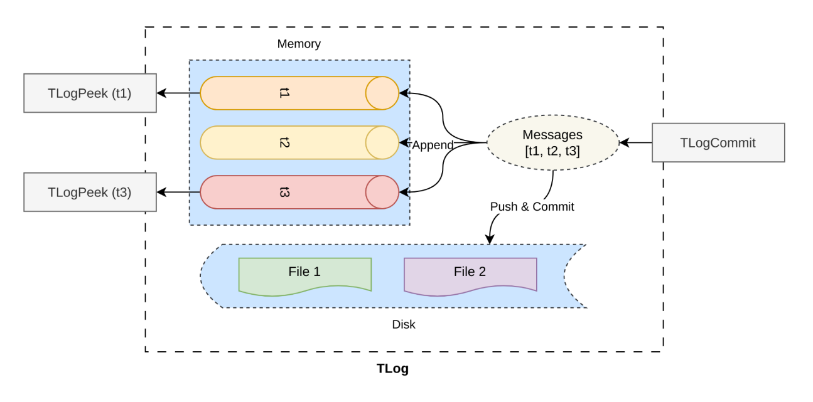
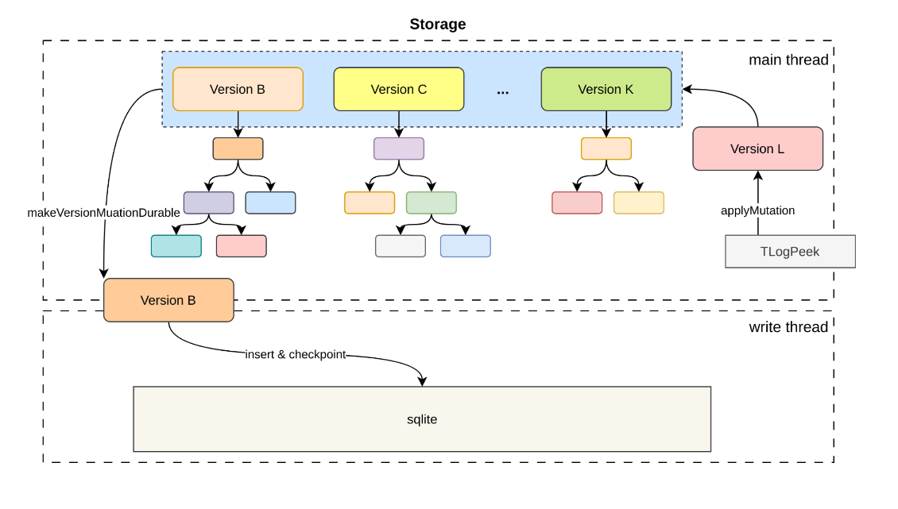

前一篇文章详细介绍了可序列化快照隔离级别以及 FoundationDB 的实现，这篇文章将介绍在通过事务冲突处理后，FoundationDB 是如何持久化数据的。

在 FoundationDB 中负责持久化数据的主要有两个组件：

- TLog: 类似于 RDMS 中的 WAL（write ahead log），提供日志的持久化能力；
- Storage: 负责应用日志、存取 key value 数据。

Commit proxy 检查完事务冲突后，将可提交的 mutations 打包到一个 message 中，并通过 `TLogCommitRequest` 发送给所有 TLog 。

## TLog

TLog 首先需要将日志按照事务提交顺序持久化。和 resolver 一样，TLog 收到的 `TLogCommitRequest` 请求可能和事务的 commit version 不同，它会在内存中对请求进行排序再进行持久化。

日志持久化由 disk queue 负责，日志在序列化后，写入 disk queue 的内存中；后者按照 4KB 为单位将日志切分成多个 page；一批数据写完后再写入磁盘。Disk queue 磁盘结构也很简单，它是两个文件组成的一个 WAL。每次写入时，将数据追加到后一个文件的末尾；如果前一个文件中的数据已经被消费完（可以清除），那么会交换两个文件顺序，之前的前一个文件会被清空，且新数据将依次追加到文件末尾。

在通常情况下，不同 storage 负责的 key 范围不一样，如果都统一从 disk queue 拉取日志，那么将读取到很多不需要的日志。为了减少 storage 拉取日志时的开销，TLog 会提前准备好每个 storage 所需要的日志。

FoundationDB 会为每个 storage 分配一个 tag，key 到 storage 的映射就等价于 key 到 tag 的映射；将 key 按照 tag 划分，得到的就是某个 storage 负责的 key 范围。Commit proxy 在准备提交请求到 TLog 前，会按照 message 中的 key 为 message 打上不同的 tag；而 TLog 会根据 message 中的 tag，将 message 按照顺序暂存在按 tag 分类的 memory queue 中。这样 storage 拉取日志时，只需要从对应 tag 的内存队列中拉取即可。

内存中的数据始终是有上限的，storage 消费并完成对日志数据的持久化后，TLog 就能释放内存中、磁盘上的数据；如果 storage 消费不及时，当 TLog 内存数据达到上限后会触发反压，拒绝新请求直到 storage 的消费速度跟上写入速度。

## Storage

Storage 会通过 `TLogPeekRequest` 从 TLog 拉取最新的日志。这些日志暂存在 storage 的内存中，最终持久化到 key value store 中。

Storage 会在内存中维护一个多版本窗口，每个版本由一棵 partial tree 组成；从 TLog 拉取的日志会按照版本生成 partial tree，并按照版本顺序组成队列。所谓的 partial tree 是 key value pairs 组成的一个 map，它只记录了一个事务版本中更新的数据。

超过窗口的数据（默认为 5s）会从内存队列中移出，并通过专用的线程写入到 key value store 中。FoundationDB 有多种 key value store 的实现，默认情况下使用 sqlite 作为底层存储引擎，此外还有 memory，redwood，rocksdb 可供选择。

Key value store 中的 key value 没有记录版本信息，因此一旦内存中的 partial tree 写入到 key value store 中，那么之前的版本信息就会丢失，而小于该版本的事务读将会被拒绝，即返回错误：`transaction too old`。

一旦数据被持久化到 key value store 中，storage 就可以通知 TLog 释放对应 tag 的内存数据；某个日志如果没有任何 tag 引用，那么就能安全地释放它所占用的磁盘空间。
