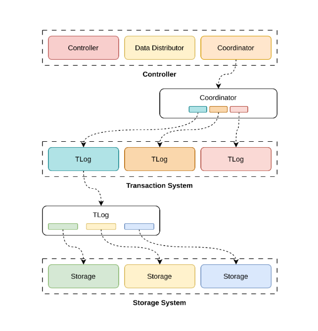
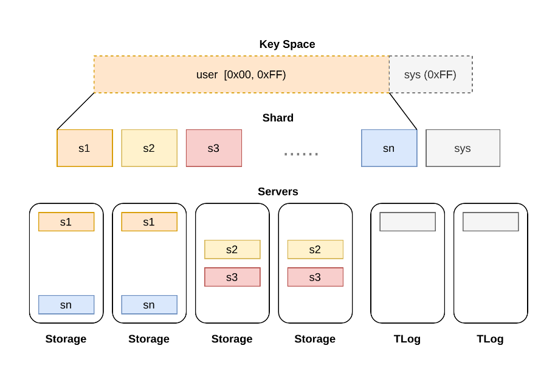

FoundationDB 是一款分布式强一致、高可扩展的 key value 数据库，它提供多版本并发控制（MVCC），同时提供了可序列化快照隔离级别（SSI）。

这里将从架构、元数据组织、数据组织三个方面，简述 FoundationDB 的架构设计，更详细的设计细节会在后续文章中介绍。

## 架构

总的来说，FoundationDB 的架构可以分成三部分：控制系统，事务系统以及存储系统。


控制系统部分提供了类似 zookeeper, etcd 等元数据管理系统的功能。它使用 disk paxos 实现选举、协调与元数据多副本的一致性。

存储系统是依赖单机 key value store 构建的一个多副本的 key value store。底层的 kv store 支持多种实现，目前有：sqlite （default），redwood 和 rocksdb。其中 redwood 是一款用于替代 sqlite 的基于 btree 的 kv store，目前主要是 snowflake 在负责开发。根据反馈，使用 redwood 作为引擎底座，在性能上比依赖 sqlite 的版本强上不少。

最复杂的是事务系统，它所涉及的组件最多。事务系统主要解决两个问题：
1. 写入事务的持久化，类似于单机 RDMS 的 WAL
2. 判断事务间是否存在冲突，是否能够提交。

## 元数据



FoundationDB 的元数据组织也可以按架构分成三部分。每个 FoundationDB 集群有一个唯一的地址，保存在 `fdb.cluster` 文件中；通过这个地址，可以定位到控制系统。

```
description:ID@IP:PORT,IP:PORT,...
```

控制系统中记录了事务系统的元数据，TLog 的位置、当前事务系统的版本号，都记录在控制系统中；client 也能通过查询控制系统，获取到事务系统的路由表。

事务系统中又记录着存储系统的元数据，key 到 storage 的映射就保存在事务系统中。

通过上述的层级关系，任何一个 client 或 server 只要能拿到 `fdb.cluster`，就能访问到集群中的任何一个节点。

## 数据组织



FoundationDB 将 key space 划分成两部分，其中前缀为 `0xFF` 的被保留为系统空间，也就是记录在事务系统中的存储系统的元数据。

剩余的 `[0x00, 0xFF)` 则用于存储用户数据。用户数据会按照 range 切分成一个个 shard，一个 shard 有多个副本，保存在不同的 storage server 上。
