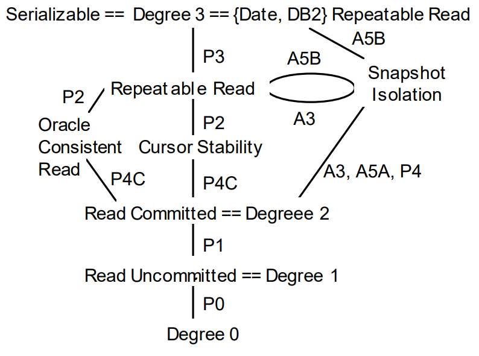
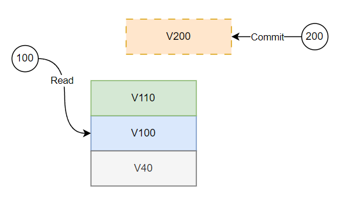
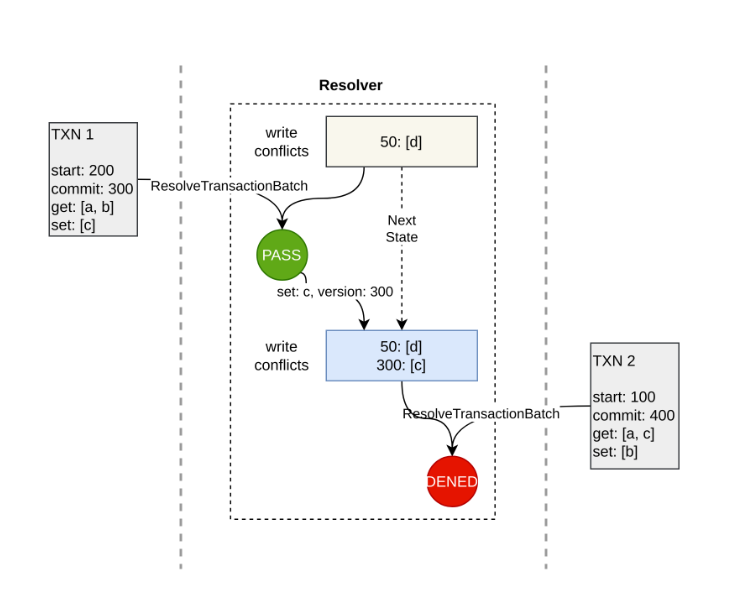

前一篇文章中提到，FoundationDB 提供了可序列化快照隔离（serializable snapshot isolation, ssi）级别，这篇文章将深入介绍 SSI 以及 FoundationDB 是如何实现的。

## 快照隔离

快照隔离是一种事务隔离级别，它属于多版本并发控制（multiversion concurreny control, MVCC），它的每个事务读都只读取该事务开始时已经提交的数据的快照。



不同事务访问相同资源时会产生竞争，处理竞争的方式可能会影响事务吞吐，比如加读写锁会让读写请求间相互等待。快照隔离可以避免读写竞争，从而提升事务的吞吐。因为在快照隔离中，任何改动都会生成一份新的快照，而后者对于已经持有数据快照的事务读是不可见的，所以只要能够维护数据快照，事务读请求就不会被阻塞。



能避免读写竞争的优点让快照隔离有了非常广泛的应用，但它仍然不完美，离理想的可序列化仍然有差距。在论文 A Critique of ANSI Isolation 中就详细介绍了快照隔离和它存在的幻象（Phantoms）： Write Skew。

### Write Skew

Write skew 是这样一种现象：两个事务分别读取不同数据，然后修改另一个事务读取的数据，并提交。在快照隔离中，由于读取的数据都是快照，和写入没有冲突，所以两个事务理论上都能提交；如果这两个数据间存在某种约束，那么这个约束将被打破，产生异常（anomaly）。

Write skew 的执行历史可以形式化定义为：

```
A5B: r1[x]...r2[y]...w1[y]...w2[x]...(c1 and c2 occur)
```

其中 1 和 2 是两个事务，r,w,c 分别是读、写和提交。

## Write Snapshot Isolation

仔细观察前面的例子可以发现，约束被打破的原因是其中一个事务提交时，它所读取到的数据已经被其他事务修改并提交了；而快照隔离只处理了写-写冲突（write-write confliction），所以无法观察到这一事实。

针对这个情况，论文 A Critique of Snapshot Isolation，提出了 write snapshot isolation，它的主要改动是：事务提交时，检查事务读所涉及到的数据是否已经被其他事务修改过。Write snapshot isolation 不再处理写-写冲突，它只关心事务间的读-写冲突（read-write confliction），如果一个事务在提交时发现读取的数据已经被其他已提交事务修改过，那么该事务无法提交。

通过检查读-写冲突来避免 write skew 异常，write snapshot isolation 能够在保留快照隔离优点的同时取得可序列化的隔离级别。FoundationDB 也正是基于这个理论来处理事务间的冲突。

## In FoundationDB

FoundationDB 的 resolver 负责处理事务间的冲突，它在内存中记录着已经提交的事务修改的数据范围和版本。

每个事务提交前，会将其读取的数据范围与 resolver 中记录的数据范围进行比较，如果存在交集说明则说明存在事务冲突，事务将被拒绝提交。需要注意的是，只有事务读数据的版本小于事务写的版本，才算存在交集；如果事务读的版本大于等于 resolver 中记录的数据的版本，那么它们之间本来就存在着先后关系，一定不存在冲突。

如果事务可提交，它改动的数据范围和版本将会更新在 resolver 中。为了保证上述数据不会超过内存限制，resolver 只会在内存中记录提交时间在 5 秒内的事务的修改范围，超过时间的将被丢弃，所以 FoundationDB client 开启的交互式事务最长生命周期为 5 秒，超过后将收到错误：`transaction too old`。

由于事务间存在顺序关系，它由 commit version 决定，而后者又是通过 master 分配给 commit proxy 的，所以 resolver 收到的 commit 请求的顺序可能和 commit version 的顺序不同。Resolver 会在内存中对 commit 请求进行排队，并按照 commit version 顺序进行处理。

下面来看一个处理冲突的具体例子。



假设有两个事务 1,2 分别在时刻 200, 100 开始，事务 1 读取 `a,b` 修改 `c`，事务 2 读取 `a,c` 修改 `b`；它们分别发送给不同的 commit proxy 完成提交，其中事务 1 拿到的提交时间为 300，事务 2 为 400，所以 resolver 先处理事务 1，再处理事务 2。

假设此时 resolver 内存中记录的已提交数据集（write conflict range）为 `50: [d]`（50 为版本，`[d]` 表示修改数据范围）。事务 1 的 read conflict range: `200: [a, b]` 与 resolver 的 write conflict range 不存在冲突，所以事务 1 可以提交。

Resolver 将事务 1 的 write conflict range 合并到内存中，此时 resolver 的 write conflict range 为:

```
50: [d]
300: [c]
```

事务 2 的 read conflict range 为: `100: [a, c]`，它与 resolver 的 `300: [c]` 存在冲突，所以事务 2 将被拒绝。


